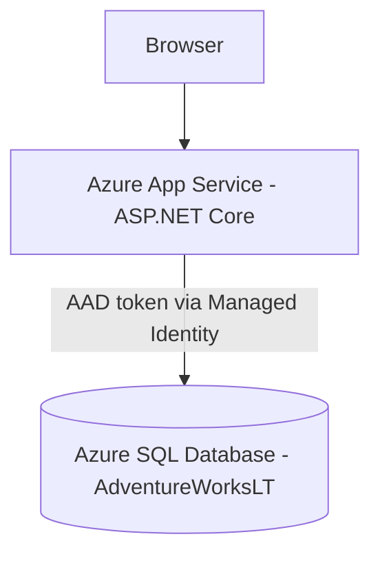

# Azure Managed Identity Demo: System vs User-Assigned (Azure SQL)

A trainer-focused demo that deploys an Azure App Service (ASP.NET Core) and an Azure SQL Database (AdventureWorksLT sample), then walks learners through difference between **system-assigned managed identity** and **user-assigned managed identity** for database access.

💪 This template scenario is part of the larger **[Microsoft Trainer Demo Deploy Catalog](https://aka.ms/trainer-demo-deploy)**.

## 📋 What You'll Deploy

- 1× Resource Group: `rg-<env>`
- 1× Azure App Service plan (Basic B1)
- 1× Azure App Service (Linux) with **System-assigned Managed Identity enabled**
- 1× Azure SQL Server
- 1× Azure SQL Database (Basic) with **AdventureWorksLT sample**
- 1× User-assigned Managed Identity (created but not used by default)

**Estimated Cost:** ~$2–$6/day (varies by region/pricing)

## 🏗️ Architecture

Data flow: the web app uses `ManagedIdentityCredential` to obtain an access token for `https://database.windows.net/` and uses that token to authenticate to Azure SQL.

## ⏰ Deployment Time

Approximately **10 minutes**.

## ⬇️ Prerequisites

- **Azure Subscription** with Owner or Contributor access
- **[Azure Developer CLI (azd)](https://learn.microsoft.com/azure/developer/azure-developer-cli/install-azd)** installed
- **[.NET 8 SDK](https://dotnet.microsoft.com/download/dotnet/8.0)**
- **[PowerShell 7+](https://learn.microsoft.com/powershell/scripting/install/installing-powershell)**

## 🚀 Deploy in 3 Steps

1. `azd init -t rob-foulkrod/tdd-managed-identity-sql`
2. `azd up`
3. `azd down --purge --force`

## ✅ Verify Deployment

- Run `azd env get-values` and confirm you have `APP_ENDPOINT`, `SQL_SERVER_FQDN`, and `SQL_DATABASE_NAME`.
- Browse to `APP_ENDPOINT` and open **Products**.
- If the database permissions aren’t configured yet, the app will show a friendly warning (this is expected for the first run).

## 🎓 What You'll Demonstrate

- System-assigned managed identity: the app authenticates to Azure SQL without secrets.
- User-assigned managed identity: the code path already exists and is activated by setting `ManagedIdentity__UserAssignedClientId`.
- Operational differences:
   - Identity lifecycle (tied to the resource vs reusable)
   - Least-privilege database roles by identity

## 📚 Demo Guide

Complete guide available in: https://github.com/rob-foulkrod/tdd-managed-identity-sql/blob/main/demoguide/demoguide.md

## 🐛 Troubleshooting

- **App shows “Unable to query Azure SQL…”**
   - Ensure the SQL server has an Azure AD admin configured.
   - Ensure the database contains a user for the app’s managed identity (`CREATE USER ... FROM EXTERNAL PROVIDER`) and appropriate role grants.
- **SQL firewall blocks your workstation**
   - Re-run `azd up` (the template captures `PUBLIC_IP` during `preup`), or add your IP in the SQL server firewall rules.

## 💰 Cost Management

- App Service plan: Basic B1 (cost-effective for demos)
- Azure SQL Database: Basic
- Use `azd down --purge --force` when finished to avoid ongoing charges.

 
